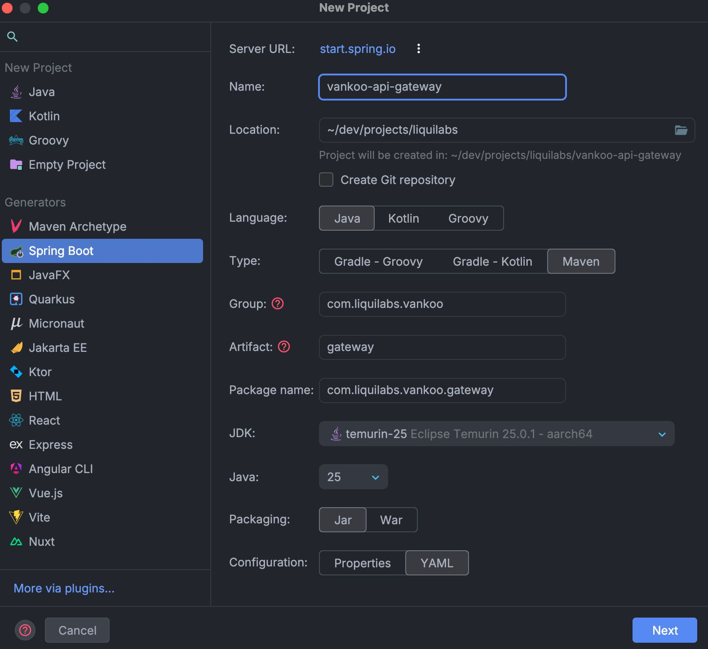
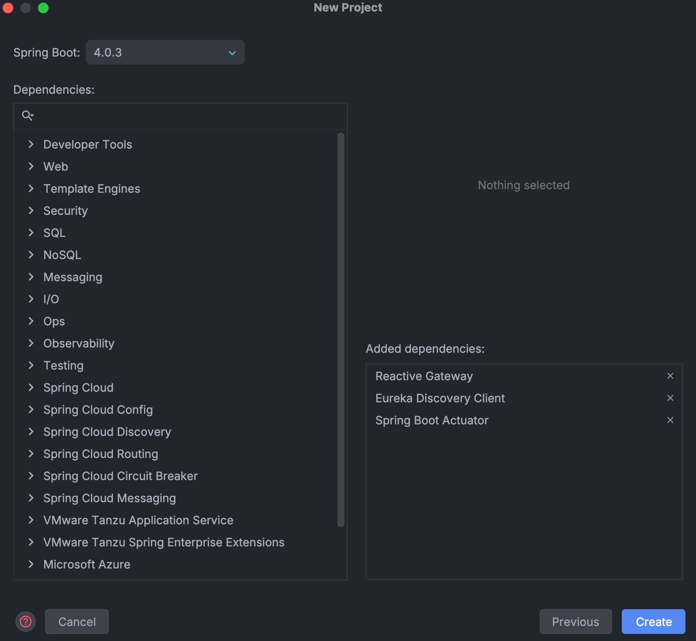

# Configuración del Proyecto

## Creación del Proyecto

Este proyecto se ha creado utilizando la interfaz de IntelliJ IDEA Ultimate, aprovechando su integración con Spring Initializr para configurar rápidamente un proyecto Spring Boot con las dependencias necesarias.

- **Name:** Se eligió `vankoo-api-gateway` para reflejar claramente su función dentro del ecosistema de microservicios de Vankoo, enfocándose en la gestión de enrutamiento y exposición de APIs a través del Gateway.
- **Location:** Idealmente ubicado en el mismo nivel que otros proyectos relacionados, como `vankoo-infra`, para facilitar la gestión del `docker-compose` y la integración entre servicios.
- **Language:** Java, dado que es el lenguaje principal para el desarrollo de microservicios con Spring Boot.
- **Type:** Maven, por su amplia adopción y compatibilidad con Spring Boot, además de facilitar la gestión de dependencias y la construcción del proyecto.
- **Group:** `com.liquilabs.vankoo`, siguiendo la convención de nomenclatura de paquetes en Java (dominio invertido), reflejando la startup (Liquilabs) y el proyecto (Vankoo).
- **Artifact:** `gateway`, nombre que refleja claramente la función del servicio dentro del ecosistema de Vankoo, centrado en la gestión de enrutamiento y exposición de APIs a través del Gateway. Omitimos el prefijo `api` para mantenerlo conciso.
- **Package name:** `com.liquilabs.vankoo.discovery`, siguiendo la convención de nomenclatura de paquetes en Java, reflejando la estructura del proyecto y su función específica dentro del ecosistema de Vankoo.
- **JDK:** temurin-25, la última versión del JDK, que ofrece mejoras de rendimiento y nuevas características, asegurando que el proyecto esté actualizado y sea compatible con las últimas tecnologías.
- **Java:** 25, para aprovechar las últimas características del lenguaje y garantizar la compatibilidad con el JDK seleccionado.
- **Packaging:** Jar, ya que es el formato estándar para aplicaciones Spring Boot, facilitando su ejecución y despliegue.
- **Configuration:** YAML, por su legibilidad y facilidad de uso para la configuración de Spring Boot, permitiendo una estructura clara y organizada para las propiedades del proyecto.

## Dependencias

Se usó la última versión de Spring Boot (4.0.3) y se seleccionaron las siguientes dependencias para cubrir las necesidades del servicio:

- **Reactive Gateway:** Esta es la versión de Spring Cloud Gateway basada en el stack reactivo de Spring WebFlux, que ofrece un rendimiento mejorado y una mayor capacidad de manejo de solicitudes concurrentes, ideal para un API Gateway en una arquitectura de microservicios.
- **Eureka Discovery Client:** Para permitir que el Gateway se registre en el Discovery Server de Eureka y pueda descubrir otros servicios registrados, facilitando el enrutamiento dinámico.
- **Spring Boot Actuator:** Para exponer endpoints de monitoreo y salud del servicio, lo que es crucial para un API Gateway que maneja el tráfico de entrada a la arquitectura.

Posteriormente, se añadieron otras dependencias clave para la funcionalidad específica del servicio, algunas son:

- **Springdoc OpenAPI Scalar:** Para generar documentación de los endpoints expuestos a través del Gateway de manera automática y la integración de Scalar con OpenAPI, facilitando la exploración y prueba de las APIs.
- **jjwt:** Para manejar la validación de tokens JWT emitidos por el IAM, asegurando que solo las solicitudes autenticadas puedan acceder a los servicios internos a través del Gateway.
- **Caffeine:** Para incorporar una caché en memoria de alto rendimiento, útil para optimizar operaciones frecuentes y reducir carga en componentes internos.
